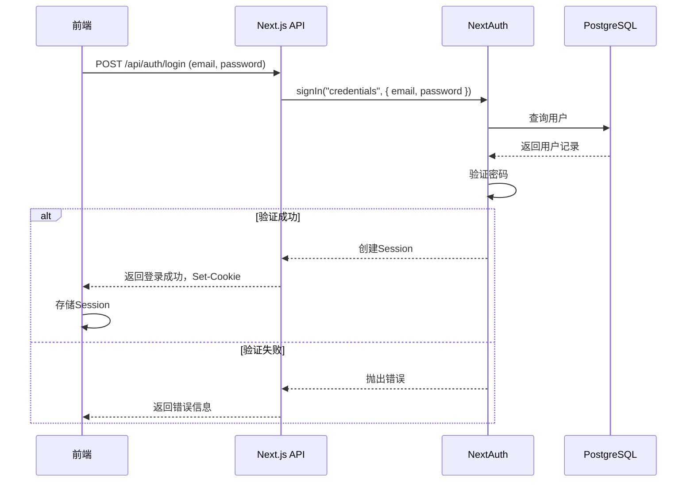
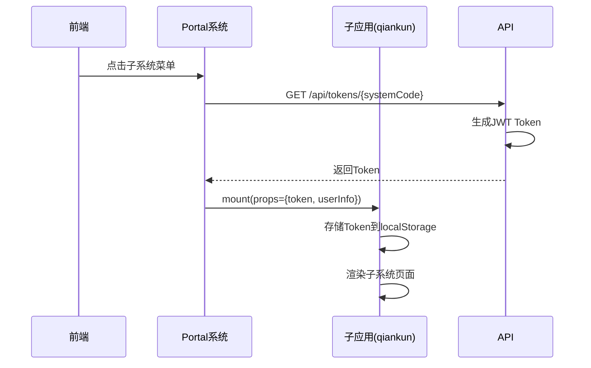
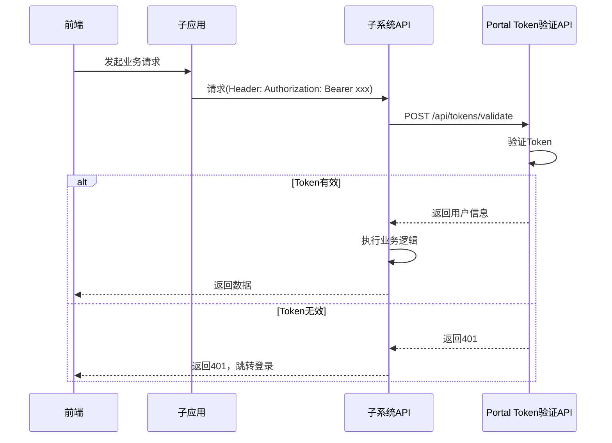

# Next.js Portal系统技术方案

## 1. 需求分析

### 1.1 核心需求

| 需求点 | 描述 | 优先级 |
|--------|------|--------|
| 前后端一体 | 采用Next.js全栈方案，前端页面与后端API统一在一个项目中 | P0 |
| 注册登录系统 | 用户注册、登录、密码找回功能 | P0 |
| 主应用入口 | 作为其他子系统的统一入口，展示子系统列表和导航 | P0 |
| Token分发 | 为其他子系统提供认证Token（JWT） | P0 |
| 用户管理 | 用户信息管理、权限控制 | P1 |
| 微前端架构 | 子系统独立部署，Portal统一入口和认证 | P0 |

### 1.2 系统角色

- **Portal系统（主应用）**：提供认证服务、用户管理、子系统导航、微前端容器
- **子系统（微应用）**：独立开发部署，通过qiankun嵌入Portal，通过Portal获取Token进行认证

---

## 2. 技术选型

### 2.1 核心技术栈

| 层次 | 技术 | 版本 | 选型理由 |
|------|------|------|----------|
| 前端框架 | Next.js | 15.x | App Router模式，全栈支持，服务端渲染能力强 |
| UI框架 | Ant Design | ^5.0.0 | 企业级UI组件库，功能丰富，生态成熟 |
| 微前端 | qiankun | ^2.0.0 | 蚂蚁金服开源，成熟稳定，支持独立部署和SSO |
| 数据库 | PostgreSQL | 16.x | 关系型数据库，支持复杂查询，适合用户认证数据 |
| ORM | Prisma | 6.x | 类型安全，自动生成类型定义，迁移管理方便 |
| 认证 | NextAuth.js | 5.x | Next.js官方推荐，支持OAuth和凭证认证，Session管理成熟 |
| 状态管理 | React Query | 最新 | 服务端状态管理，缓存策略完善 |
| API校验 | Zod | 最新 | 类型安全的API参数校验 |

### 2.2 目录结构设计

```
/Users/maogee/Documents/trae_projects/my_portal/
├── app/                      # Next.js App Router
│   ├── (auth)/               # 认证页面组（不展示导航）
│   │   ├── login/            # 登录页面
│   │   ├── register/         # 注册页面
│   │   └── forgot-password/  # 找回密码页面
│   ├── (dashboard)/          # 主应用页面组
│   │   ├── layout.tsx        # 主布局（带导航）
│   │   ├── index.tsx         # 首页/子系统列表
│   │   ├── profile/          # 用户个人中心
│   │   ├── systems/          # 子系统管理
│   │   └── app/              # 微应用挂载容器
│   │       └── [systemCode]/ # 子系统路由
│   ├── api/                  # API路由
│   │   ├── auth/             # 认证相关API
│   │   ├── systems/          # 子系统管理API
│   │   ├── users/            # 用户管理API
│   │   └── tokens/           # Token分发API
│   ├── globals.css           # 全局样式
│   └── layout.tsx            # 根布局
├── lib/                      # 核心库
│   ├── auth.ts               # NextAuth配置
│   ├── prisma.ts             # Prisma客户端
│   ├── jwt.ts                # JWT工具函数
│   ├── qiankun.ts            # qiankun配置
│   └── utils.ts              # 通用工具函数
├── components/               # 通用组件
│   ├── layout/               # 布局组件（Header, Sidebar）
│   ├── auth/                 # 认证相关组件
│   └── common/               # 通用业务组件
├── prisma/                   # Prisma配置
│   ├── schema.prisma         # 数据库模型定义
│   └── migrations/           # 数据库迁移文件
├── types/                    # TypeScript类型定义
│   └── index.ts              # 全局类型
├── middleware.ts             # 路由中间件（权限控制）
├── next.config.ts            # Next.js配置
├── tsconfig.json             # TypeScript配置
└── package.json              # 项目依赖
```

---

## 3. 数据库设计

### 3.1 核心实体

#### 3.1.1 User（用户）

| 字段名 | 类型 | 约束 | 说明 |
|--------|------|------|------|
| id | UUID | PK | 用户唯一标识 |
| email | String | Unique, Required | 用户邮箱 |
| password | String | Required | 加密后的密码 |
| name | String | Required | 用户姓名 |
| avatar | String | Optional | 头像URL |
| role | Enum | Required | 用户角色（admin/user） |
| status | Enum | Required | 用户状态（active/inactive） |
| createdAt | DateTime | Required | 创建时间 |
| updatedAt | DateTime | Required | 更新时间 |

#### 3.1.2 System（子系统）

| 字段名 | 类型 | 约束 | 说明 |
|--------|------|------|------|
| id | UUID | PK | 子系统唯一标识 |
| name | String | Required | 子系统名称 |
| code | String | Unique, Required | 子系统编码（用于路由和Token） |
| url | String | Required | 子系统访问地址（qiankun加载地址） |
| icon | String | Optional | 子系统图标（Ant Design图标名） |
| description | String | Optional | 子系统描述 |
| isActive | Boolean | Required | 是否启用 |
| sortOrder | Int | Optional | 排序顺序 |
| createdAt | DateTime | Required | 创建时间 |
| updatedAt | DateTime | Required | 更新时间 |

#### 3.1.3 UserSystem（用户-子系统关联）

| 字段名 | 类型 | 约束 | 说明 |
|--------|------|------|------|
| userId | UUID | FK(User.id) | 用户ID |
| systemId | UUID | FK(System.id) | 子系统ID |
| createdAt | DateTime | Required | 创建时间 |

#### 3.1.4 Token（Token记录）

| 字段名 | 类型 | 约束 | 说明 |
|--------|------|------|------|
| id | UUID | PK | Token唯一标识 |
| userId | UUID | FK(User.id) | 用户ID |
| systemId | UUID | FK(System.id) | 子系统ID |
| token | String | Required | JWT Token |
| expiresAt | DateTime | Required | 过期时间 |
| createdAt | DateTime | Required | 创建时间 |

### 3.2 关系图

```
User 1 ──── * UserSystem * ──── 1 System
  │                               │
  │                               │
  *                               *
Token ────────────────────────────
```

---

## 4. 微前端架构设计

### 4.1 qiankun集成方案

#### 4.1.1 架构优势

| 特性 | 说明 |
|------|------|
| 独立部署 | 子系统可独立开发、测试、部署，不影响主应用 |
| 技术栈无关 | 子系统可使用Vue/React/Angular等任意技术栈 |
| 统一认证 | Portal提供统一登录，子系统共享用户Session |
| 资源隔离 | 样式隔离（shadow DOM）、JS沙箱隔离 |
| 路由联动 | 主应用路由与子应用路由自动同步 |

#### 4.1.2 主应用配置

```typescript
// lib/qiankun.ts
import { registerMicroApps, start, initGlobalState } from 'qiankun';

export interface MicroAppConfig {
  name: string;
  entry: string;
  container: string;
  activeRule: string;
  props?: Record<string, any>;
}

export function setupQiankun(systems: System[]) {
  const microApps: MicroAppConfig[] = systems
    .filter(system => system.isActive)
    .map(system => ({
      name: system.code,
      entry: system.url,
      container: '#micro-app-container',
      activeRule: `/app/${system.code}`,
      props: {
        token: '',
        userInfo: null,
      },
    }));

  registerMicroApps(microApps);
  
  const actions = initGlobalState({
    token: '',
    userInfo: null,
  });

  return actions;
}
```

#### 4.1.3 子应用接入规范

**子应用需要实现以下生命周期钩子：**

| 钩子 | 说明 |
|------|------|
| `bootstrap` | 启动时调用一次 |
| `mount` | 挂载时调用，接收主应用传递的props |
| `unmount` | 卸载时调用 |

**子应用获取Token方式：**

```typescript
// 子应用中获取主应用传递的Token
export function mount(props: { token?: string; userInfo?: User }) {
  if (props.token) {
    localStorage.setItem('portal_token', props.token);
  }
  if (props.userInfo) {
    localStorage.setItem('user_info', JSON.stringify(props.userInfo));
  }
}
```

### 4.2 子系统独立部署架构

```
┌─────────────────────────────────────────────────────────────┐
│                      Nginx反向代理                           │
├─────────────────────────────────────────────────────────────┤
│                                                             │
│  ┌──────────────┐    ┌──────────────┐    ┌──────────────┐  │
│  │   Portal     │    │  System-A    │    │  System-B    │  │
│  │  (主应用)    │    │  (微应用)    │    │  (微应用)    │  │
│  │  portal.com  │    │  sa.xxx.com  │    │  sb.xxx.com  │  │
│  └──────────────┘    └──────────────┘    └──────────────┘  │
│         │                   │                   │          │
│         └───────────────────┴───────────────────┘          │
│                             │                               │
│                      ┌──────────────┐                       │
│                      │ PostgreSQL   │                       │
│                      │  共享数据库  │                       │
│                      └──────────────┘                       │
└─────────────────────────────────────────────────────────────┘
```

---

## 5. 认证架构

### 5.1 认证流程

#### 5.1.1 登录流程



#### 5.1.2 子系统Token获取流程



#### 5.1.3 子系统API调用认证



### 5.2 JWT Token结构

```json
{
  "sub": "user-uuid",
  "email": "user@example.com",
  "name": "张三",
  "role": "user",
  "system": "order-service",
  "iat": 1718542800,
  "exp": 1718546400
}
```

### 5.3 安全策略

| 安全项 | 策略 |
|--------|------|
| 密码存储 | bcrypt哈希（10轮） |
| Token传输 | HTTPS强制 |
| Session管理 | HttpOnly Cookie |
| Token过期 | 短期有效（1小时） |
| 刷新机制 | 支持Token刷新 |
| 微前端隔离 | qiankun JS沙箱 + 样式隔离 |

---

## 6. API设计

### 6.1 认证API

| 端点 | 方法 | 认证 | 描述 |
|------|------|------|------|
| `/api/auth/login` | POST | 否 | 用户登录 |
| `/api/auth/register` | POST | 否 | 用户注册 |
| `/api/auth/forgot-password` | POST | 否 | 发送找回密码邮件 |
| `/api/auth/reset-password` | POST | 否 | 重置密码 |
| `/api/auth/session` | GET | 是 | 获取当前Session |
| `/api/auth/logout` | POST | 是 | 用户登出 |

### 6.2 子系统API

| 端点 | 方法 | 认证 | 描述 |
|------|------|------|------|
| `/api/systems` | GET | 是 | 获取子系统列表 |
| `/api/systems` | POST | 是(admin) | 创建子系统 |
| `/api/systems/[id]` | GET | 是 | 获取子系统详情 |
| `/api/systems/[id]` | PUT | 是(admin) | 更新子系统 |
| `/api/systems/[id]` | DELETE | 是(admin) | 删除子系统 |

### 6.3 Token API

| 端点 | 方法 | 认证 | 描述 |
|------|------|------|------|
| `/api/tokens/[systemCode]` | GET | 是 | 获取指定子系统的Token |
| `/api/tokens/validate` | POST | 否 | 验证Token有效性（供子系统调用） |
| `/api/tokens/refresh` | POST | 是 | 刷新Token |

### 6.4 用户API

| 端点 | 方法 | 认证 | 描述 |
|------|------|------|------|
| `/api/users/me` | GET | 是 | 获取当前用户信息 |
| `/api/users/me` | PUT | 是 | 更新当前用户信息 |
| `/api/users` | GET | 是(admin) | 获取用户列表 |
| `/api/users/[id]` | GET | 是(admin) | 获取用户详情 |
| `/api/users/[id]` | PUT | 是(admin) | 更新用户信息 |

---

## 7. 页面设计

### 7.1 页面清单

| 页面路径 | 说明 | 权限 |
|----------|------|------|
| `/login` | 登录页 | 公开 |
| `/register` | 注册页 | 公开 |
| `/forgot-password` | 找回密码页 | 公开 |
| `/` | 首页（子系统列表） | 登录用户 |
| `/profile` | 用户个人中心 | 登录用户 |
| `/systems` | 子系统管理 | 管理员 |
| `/app/[systemCode]` | 子系统微应用容器 | 登录用户 |

### 7.2 页面布局

```
┌─────────────────────────────────────────────────────┐
│  Header（导航栏） - Ant Design Layout.Header         │
│  ┌──────────┬─────────────────┬──────────────────┐ │
│  │ Logo     │ 子系统列表下拉   │ 用户头像/退出    │ │
│  └──────────┴─────────────────┴──────────────────┘ │
├─────────────────────────────────────────────────────┤
│  Sidebar（侧边栏） - Ant Design Layout.Sider        │
│  ┌───────────────────────────────────────────────┐ │
│  │ 🏠 首页                                        │ │
│  │ ────────────────────────────────────────────  │ │
│  │ 📦 子系统1                                    │ │
│  │ 📦 子系统2                                    │ │
│  │ 📦 子系统3                                    │ │
│  │ ────────────────────────────────────────────  │ │
│  │ 👤 个人中心                                    │ │
│  │ ⚙️ 子系统管理（管理员）                        │ │
│  └───────────────────────────────────────────────┘ │
├─────────────────────────────────────────────────────┤
│  Main Content（主内容区） - Ant Design Layout.Content│
│                                                     │
│  ┌─────────────────────────────────────────────┐   │
│  │                                             │   │
│  │    子系统列表卡片 或 微应用容器(#micro-app-container)│
│  │                                             │   │
│  └─────────────────────────────────────────────┘   │
└─────────────────────────────────────────────────────┘
```

### 7.3 Ant Design组件使用规划

| 组件 | 用途 |
|------|------|
| `Layout` | 整体布局框架 |
| `Menu` | 侧边栏导航菜单 |
| `Button` | 按钮组件 |
| `Form` | 表单（登录/注册） |
| `Input` | 输入框 |
| `Card` | 子系统列表卡片 |
| `Table` | 子系统管理表格 |
| `Modal` | 弹窗（新增/编辑子系统） |
| `Avatar` | 用户头像 |
| `Dropdown` | 用户下拉菜单 |

---

## 8. 关键功能实现

### 8.1 注册登录系统

#### 8.1.1 注册流程

1. 用户提交注册表单（email, password, name）
2. Zod验证邮箱格式和密码强度
3. 查询邮箱是否已存在
4. bcrypt密码哈希存储
5. 创建用户记录
6. 自动登录

#### 8.1.2 登录流程

1. 用户提交登录表单（email, password）
2. 查询用户记录
3. bcrypt验证密码
4. NextAuth创建Session
5. 跳转首页

### 8.2 微前端集成

#### 8.2.1 qiankun初始化

```typescript
// app/(dashboard)/layout.tsx
'use client';

import { useEffect, useState } from 'react';
import { setupQiankun } from '@/lib/qiankun';
import { getSystems } from '@/services/systems';

export default function DashboardLayout({ children }) {
  const [systems, setSystems] = useState([]);

  useEffect(() => {
    async function init() {
      const data = await getSystems();
      setSystems(data);
      setupQiankun(data);
    }
    init();
  }, []);

  return (
    <Layout>
      <Sidebar systems={systems} />
      <Layout>
        <Header />
        <Content>{children}</Content>
      </Layout>
    </Layout>
  );
}
```

#### 8.2.2 微应用容器页面

```typescript
// app/(dashboard)/app/[systemCode]/page.tsx
'use client';

import { useEffect } from 'react';
import { useParams } from 'next/navigation';
import { getToken } from '@/services/tokens';

export default function MicroAppPage() {
  const { systemCode } = useParams();

  useEffect(() => {
    async function fetchToken() {
      const token = await getToken(systemCode);
      // 更新qiankun全局状态
      window.__POWERED_BY_QIANKUN__?.actions?.setGlobalState({ token });
    }
    fetchToken();
  }, [systemCode]);

  return <div id="micro-app-container" style={{ height: '100%' }} />;
}
```

### 8.3 Token分发机制

#### 8.3.1 Token生成

```typescript
// lib/jwt.ts
import jwt from 'jsonwebtoken';
import { prisma } from './prisma';

export interface DecodedToken {
  sub: string;
  email: string;
  name: string;
  role: string;
  system: string;
  iat: number;
  exp: number;
}

export async function generateSystemToken(userId: string, systemCode: string): Promise<string> {
  const user = await prisma.user.findUnique({ where: { id: userId } });
  if (!user) throw new Error('用户不存在');
  
  const payload: Omit<DecodedToken, 'iat' | 'exp'> = {
    sub: userId,
    email: user.email,
    name: user.name,
    role: user.role,
    system: systemCode,
  };
  
  return jwt.sign(payload, process.env.JWT_SECRET!, {
    expiresIn: '1h',
  });
}
```

#### 8.3.2 Token验证

```typescript
// lib/jwt.ts
export async function validateToken(token: string): Promise<DecodedToken | null> {
  try {
    const decoded = jwt.verify(token, process.env.JWT_SECRET!) as DecodedToken;
    
    const user = await prisma.user.findUnique({ where: { id: decoded.sub } });
    if (!user || user.status !== 'active') return null;
    
    const system = await prisma.system.findUnique({ where: { code: decoded.system } });
    if (!system || !system.isActive) return null;
    
    return decoded;
  } catch {
    return null;
  }
}
```

---

## 9. 部署方案

### 9.1 环境配置

| 环境 | 说明 |
|------|------|
| 开发环境 | 本地运行，子系统通过qiankun本地开发服务器加载 |
| 测试环境 | Docker容器化部署 |
| 生产环境 | Vercel/ECS + PostgreSQL云数据库，Nginx反向代理 |

### 9.2 Nginx配置示例

```nginx
upstream portal {
    server portal:3000;
}

upstream system-a {
    server system-a:8080;
}

upstream system-b {
    server system-b:8081;
}

server {
    listen 80;
    server_name portal.example.com;

    location / {
        proxy_pass http://portal;
        proxy_set_header Host $host;
        proxy_set_header X-Real-IP $remote_addr;
    }

    location /app/system-a {
        proxy_pass http://system-a;
        proxy_set_header Host $host;
        proxy_set_header X-Real-IP $remote_addr;
    }

    location /app/system-b {
        proxy_pass http://system-b;
        proxy_set_header Host $host;
        proxy_set_header X-Real-IP $remote_addr;
    }
}
```

### 9.3 环境变量

| 变量名 | 说明 |
|--------|------|
| `DATABASE_URL` | PostgreSQL连接字符串 |
| `JWT_SECRET` | JWT签名密钥 |
| `NEXTAUTH_SECRET` | NextAuth密钥 |
| `NEXTAUTH_URL` | NextAuth回调地址 |
| `NODE_ENV` | 运行环境（development/production） |

---

## 10. 子系统接入指南

### 10.1 子系统开发要求

1. **技术栈**：任意技术栈（Vue/React/Angular等）
2. **生命周期钩子**：必须实现bootstrap、mount、unmount
3. **样式隔离**：使用scoped样式或shadow DOM
4. **路由前缀**：路由需添加系统code前缀

### 10.2 子系统注册流程

1. 管理员在Portal系统创建子系统记录（name, code, url, icon）
2. 子系统部署到独立服务器
3. 用户在Portal首页看到子系统卡片
4. 点击卡片进入子系统微应用容器

---

## 11. 风险与应对

| 风险点 | 风险等级 | 应对措施 |
|--------|----------|----------|
| Token泄露 | 高 | HTTPS传输，短期过期，HttpOnly Cookie |
| SQL注入 | 高 | 使用Prisma ORM，参数化查询 |
| 暴力破解 | 中 | 登录失败次数限制，验证码 |
| 子系统认证绕过 | 中 | Token绑定子系统，双重验证 |
| 密码明文存储 | 高 | bcrypt哈希加密 |
| 微前端样式冲突 | 中 | qiankun样式隔离，CSS Modules |
| 子系统JS冲突 | 中 | qiankun JS沙箱隔离 |

---

## 12. 实施步骤

### 阶段一：项目初始化（第1天）

1. 创建Next.js项目（App Router）
2. 安装核心依赖（Prisma, NextAuth, Ant Design, qiankun等）
3. 配置TypeScript路径别名
4. 初始化Prisma数据库

### 阶段二：数据库与认证（第2-3天）

1. 定义Prisma Schema
2. 执行数据库迁移
3. 配置NextAuth认证
4. 实现注册登录API

### 阶段三：子系统管理与Token（第4-5天）

1. 实现子系统CRUD API
2. 实现Token生成与验证API
3. 创建子系统管理页面
4. 实现用户-子系统关联

### 阶段四：微前端集成（第6天）

1. 配置qiankun主应用
2. 实现微应用容器页面
3. 实现全局状态管理
4. 测试微前端加载

### 阶段五：前端页面（第7-8天）

1. 集成Ant Design组件库
2. 实现登录注册页面
3. 实现首页子系统列表
4. 实现用户个人中心

### 阶段六：测试与部署（第9天）

1. 编写单元测试
2. 测试集成验证
3. 配置部署环境
4. 部署上线

---

## 13. 依赖清单

| 依赖 | 版本 | 用途 |
|------|------|------|
| `next` | ^15.0.0 | Next.js框架 |
| `react` | ^19.0.0 | React库 |
| `typescript` | ^5.0.0 | TypeScript |
| `prisma` | ^6.0.0 | ORM |
| `@prisma/client` | ^6.0.0 | Prisma客户端 |
| `next-auth` | ^5.0.0 | 认证 |
| `bcrypt` | ^5.0.0 | 密码哈希 |
| `jsonwebtoken` | ^9.0.0 | JWT |
| `zod` | ^3.0.0 | 类型校验 |
| `antd` | ^5.0.0 | UI框架 |
| `@ant-design/icons` | ^5.0.0 | Ant Design图标 |
| `qiankun` | ^2.0.0 | 微前端框架 |
| `react-query` | ^3.0.0 | 状态管理 |
